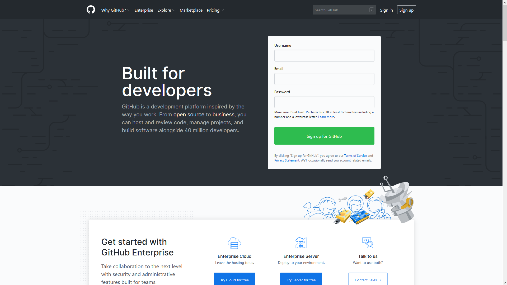
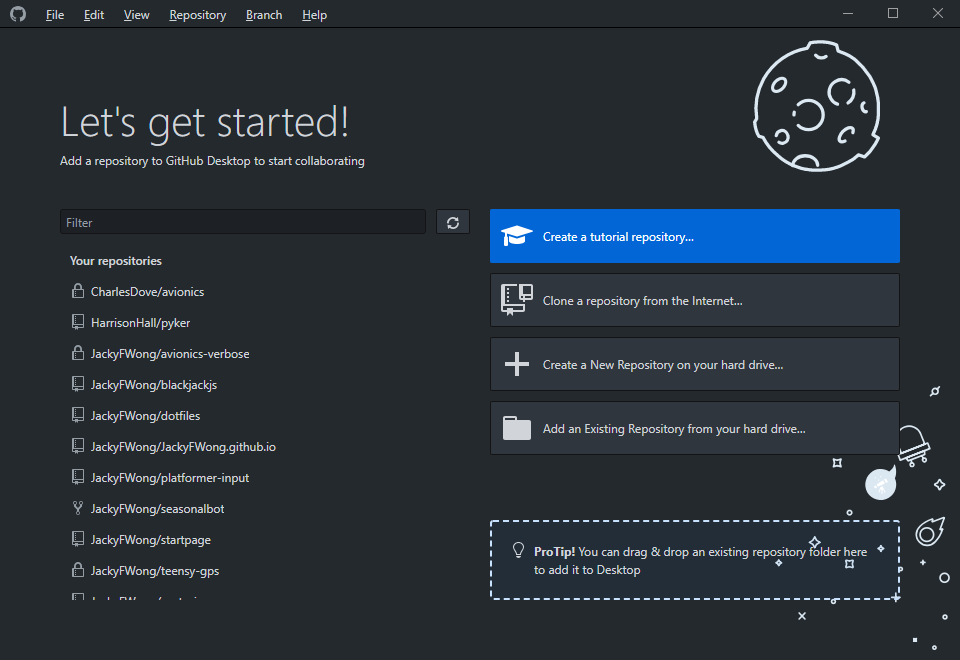
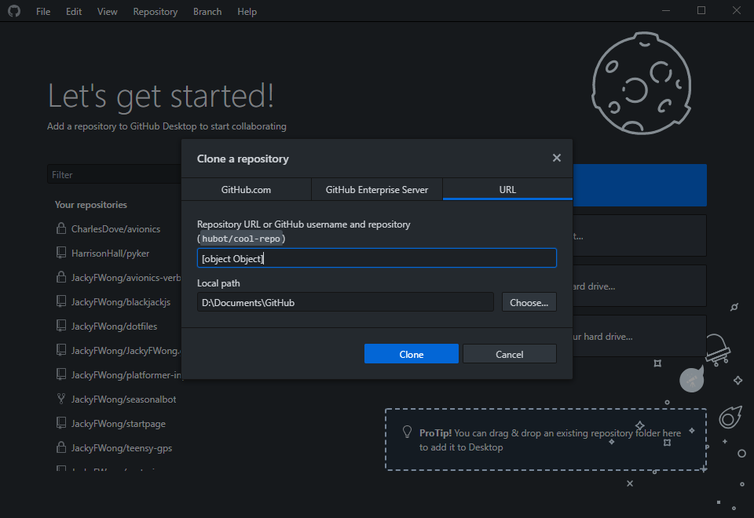
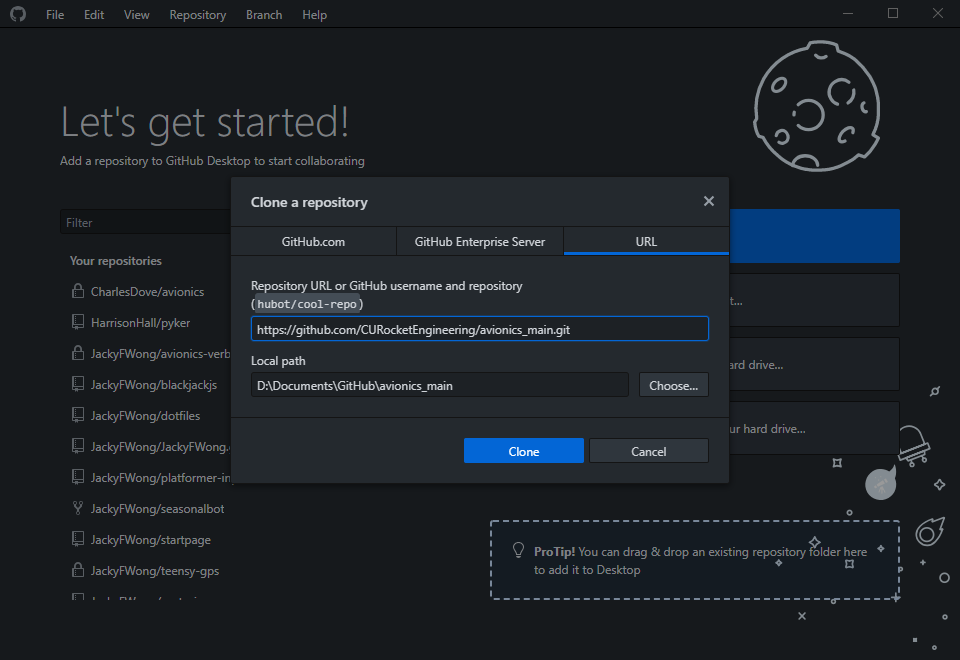
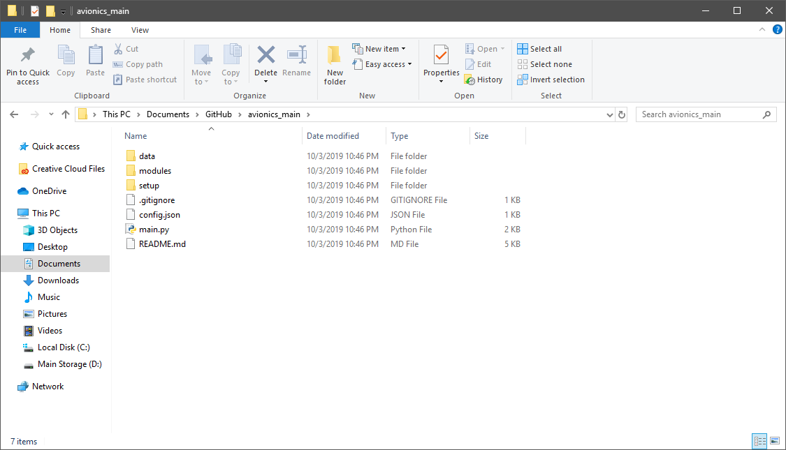
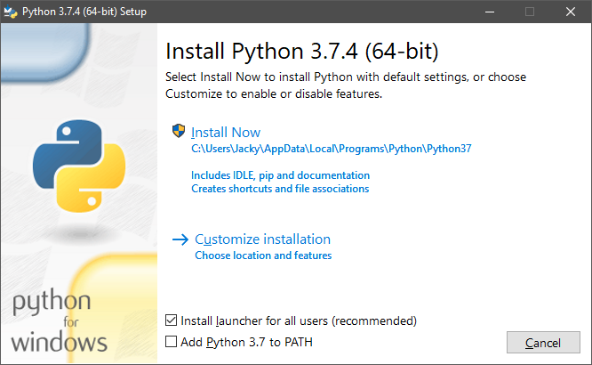
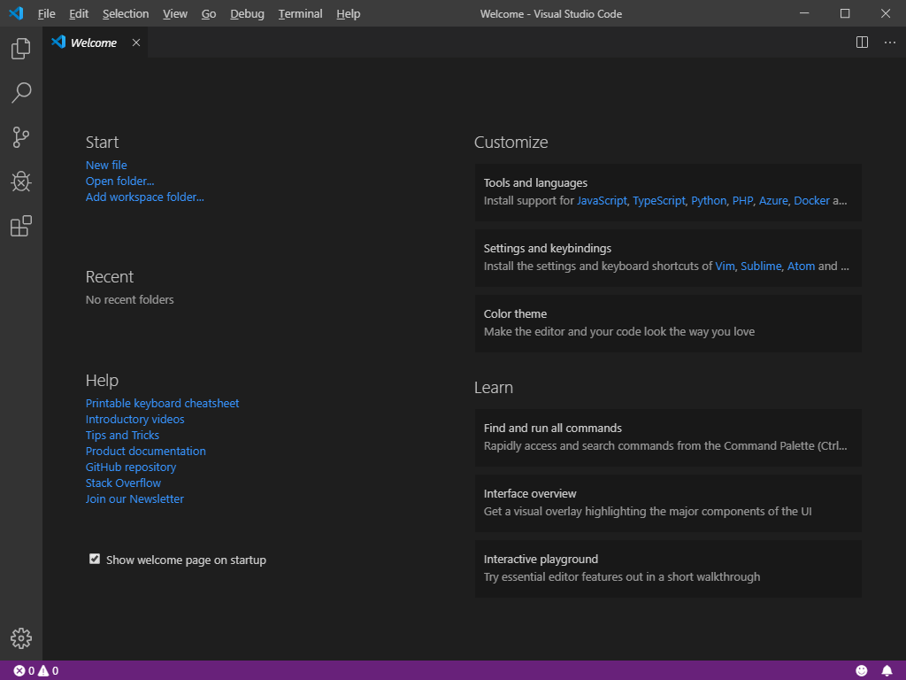

# Avionics Programming Start Guide for Beginners (Windows 10)
Jacky Wong.

To do: Introduce using GitHub, and with Atom/VS Code.

## GitHub
In order to manage the avionics files properly, we will be using GitHub, a
service that provides a collaboration platform for software developers through
Git, a version-control software system.

### What does that mean?
Code is held inside GitHub servers, where anybody can look at it (unless the
code is held privately). Only authorized people can modify the code.

A code project is held inside a repository. This repository, or repo, has
multiple branches, which are different versions of the same code, usually at
different places in development. Git also keeps track of the history of the
code, so anybody can see who wrote what piece of code.

### Getting Started with GitHub, the Easy Way
1. Create a GitHub account.
    - Go to [GitHub.com](https://github.com/), and use the prompt to create an
    account.
    
    - You will see a few screens that ask you about your subscription and
    coding experience. You can answer them, or not. As a student, you do have
    access to GitHub Pro, but I personally don't use it much.
    - GitHub will automatically create a `hello-world` repo for you. Look
    through it at your leisure.
2. Contact me, Jacky Wong (on Slack), and let me know your username.
3. Download [GitHub Desktop](https://desktop.github.com/). This is a good
graphical GitHub interface, good for getting started with contributing.
4. Set up GitHub Desktop.
    - For whatever reason, I couldn't properly uninstall
    GitHub Desktop to demonstrate, but go through the initial dialogues and
    sign in with your GitHub account.
    - You will see a screen similar to this, but you won't have a list of
    repos, unless you have the `hello-world` repo I mentioned earlier.
    
    - Click on "Clone a repository from the Internet..."
    - You will see this, or something similar:
    
    - Go to the avionics repo, located at
    [CURocketEngineering/avionics_main](https://github.com/CURocketEngineering/avionics_main)
    - Click on "Clone or download", then copy the link.
    - Go back to your GitHub Desktop, then paste the link in the first box.
    
    The application should auto-fill your local path, but in case it isn't,
    choose an appropriate folder you want all of your GitHub repos to be saved.
    The `avionics_main` repo will be a subfolder inside that. Click "Clone".
    You will now have the repo on your own machine.
    

#### Congratulations, now you have GitHub on your Windows 10 computer!

## Python
Python is the language of our avionics code, newly created for the 2019-2020
year. It is a relatively easy-to-use programming language, and can be very
powerful yet also easy. I'm not going to teach it here, as I don't actually
know it well. Instead, here's how to install it.

Now, you can do this the easy way or hard way. I'll let you choose.

### The Easy Way
1. Go to the Microsoft Store, through your Start Menu.
2. Use the search bar, and search `python 3.7`.
3. Find "Python 3.7", the one by the Python Software Foundation. It will look
like this:

4. Go through the install process. I can't actually go through this process on
my machine, either because I already have Python, or because I changed some
Windows settings that make my machine incompatible.

### The Hard Way
1. It's not actually much harder, but will install Python without leaving
anything out (which is more than necessary for avionics, probably).
Regardless, go to the official Python website, specifically
[Using Python on Windows](https://docs.python.org/3/using/windows.html).
2. You can read through the good
[documentation](https://docs.python.org/3/using/windows.html), but for now,
scroll down and click "Windows x86-64 executable installer".
3. Once downloaded, open the executable and run the installer.
Again, I can't show what this looks like as I've already installed Python.

You can use the default settings, but I highly recommend checking
"Add Python 3.7 to PATH". This makes it so that you can easily execute
Python programs through the command line, if you need to.
4. Click "Install Now". Go thorugh the steps.

#### Congratulations, now you have Python 3.7 on your Windows 10 computer!

## Code Editor
You will need a good code editor, or integrated development environment, to
easily view and develop code. I recommend Atom or Visual Studio Code, the
former of which I use personally for Windows 10. I will be showing both,
but my VS Code install is fresh and will look pretty close to yours.

### Atom
Atom is the "official" editor of GitHub, created by GitHub. It is very bare
bones on a fresh install, but you can customize it very heavily to suit your
needs and preferences exactly, if that sounds like what you want, keep reading.
1. Download [Atom](https://atom.io/).
2. Install Atom. I can't show the install process as running the installer
just updates my own Atom.  There _shouldn't_ be any hidden tricks to this.
3. Launch Atom.

#### Packages
This is where Atom shines. You can install any package that suits your needs.
1. Once Atom is open, go to the top, File > Settings. You will get this,
but in a different color scheme.

2. Go to "Install" on the left bar. You can go install whatever you'd like,
but I've included a list below of what I recommend, and some personally use.
3. You can toggle between "Packages" and "Themes" to search for them. These
will show up under "Packages" and "Themes" respectively on the left bar once
installed.
4. For a list of what you can install, go to Atom's website for the community
[Packages](https://atom.io/packages) and [Themes](https://atom.io/themes).

#### Congratulations, now you have Atom on your Windows 10 computer!

### Visual Studio Code
VS Code is Microsoft's official code editor, as well as what they recommend
for Python development on Windows. It is arguably more powerful than Atom,
especially out of the box, and will provide everything you will probably need
and then some.
1. Download [VS Code](https://code.visualstudio.com/).
2. Install VS Code. There should be no hiccups. It will look like this:

3. Click the "Python" button under "Tools and languages" to install Python
support.
4. Because I've not used VS Code myself, follow Microsoft's excellent
[guide](https://docs.microsoft.com/en-us/windows/python/get-started/python-for-education)
to finish installation, specifically under the heading "Install Visual Studio
Code". If you run into any issues, let me know, and I might be able to help.

#### Congratulations, now you (should) have VS Code on your Windows 10 computer!

## Atom Packages
If Atom already has these installed, great. Keep in mind, using more
packages may slow down your Atom installation.
Again, go to [Packages](https://atom.io/packages) and
[Themes](https://atom.io/themes) on Atom's website and browse at your leisure.
- `ide-python` > Should provide everything essential for Python
development inside Atom.
- `atom-beautify` > Makes code inside Atom look good and readable.
- `highlight-selected` > Allows you to easily see occurrences of a
selected group of characters.
- `file-icons` > Adds icons to your Atom directory browser.
- `bracket-matcher` > Allows you to see matching brackets and hop between them
with `Ctrl+M`.
- `minimap` > Shows a preview of your entire code file, like a minimap in a
video game, and allows you to easily scrub to what you want.
- `tree-view` > Provides a way to see and open files in your current project.
- `whitespace` > Good tool for to ensure all your tabs are spaces.
- Themes: Choose what you think looks good, but keep in mind that you also
need a syntax theme as well as a UI theme. I personally use `atom-material-ui`
and `atom-material-syntax`.
